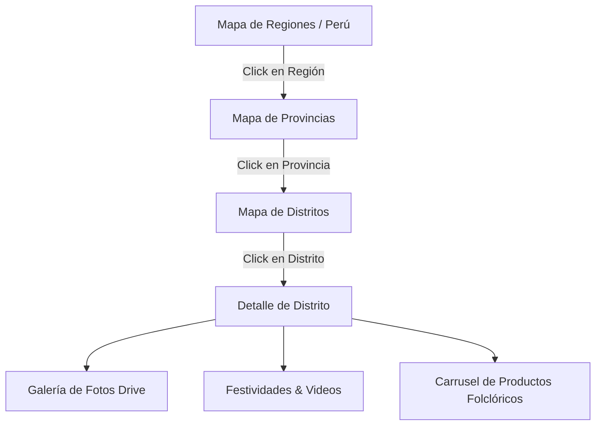

# Especificación de Diseño: Mapa Interactivo 3D "Mi Perú"

Esta especificación detalla el diseño técnico y visual de la sección "Mi Perú" en el frontend, la cual permite la navegación jerárquica a través de un mapa tridimensional interactivo por regiones, provincias y distritos del Perú, integrando contenido cultural (Google Drive) y productos del catálogo.

## 1. Arquitectura y Navegación

El componente implementará una navegación de 3 niveles:
1. **Nivel Nacional (Regiones):** Muestra el mapa completo del Perú dividido en departamentos. Cusco y Huancavelica estarán resaltados con una estética premium para invitar a la exploración, ya que cuentan con contenido cultural sincronizado.
2. **Nivel Regional (Provincias):** Al hacer clic en Huancavelica o Cusco, la cámara realiza un zoom animado, el mapa nacional se desvanece y se dibuja el mapa de provincias (ej. para Huancavelica se renderizan sus 7 provincias).
3. **Nivel Provincial (Distritos):** Al hacer clic en una provincia (ej. Urubamba en Cusco, o Acobamba en Huancavelica), se muestra el mapa detallado de sus distritos.
4. **Ficha de Detalle de Distrito:** Al seleccionar un distrito (ej. Pisac en Urubamba, o Yauli en Huancavelica), se abre un panel lateral o sección detallada con:
   - Resumen histórico y datos generales (`howToGetThere`, `history`, `coordinates`).
   - Galería de fotos (cargadas desde Google Drive).
   - Festividades locales y videos de YouTube relacionados.
   - Carrusel de productos folclóricos de la tienda asociados a las culturas practicadas en ese distrito.

---

## 2. Diseño Estético y Tridimensionalidad (Enfoque Isométrico 3D)

Para lograr un efecto visual impresionante y de alta fidelidad con excelente rendimiento, usaremos una proyección isométrica 3D basada en CSS3D:
- **Estructura del Lienzo:** El mapa se renderiza en un contenedor con perspectiva 3D (`perspective: 1000px`).
- **Efecto Flotante Isométrico:** El mapa completo tiene aplicadas propiedades de transformación CSS (`rotateX(55deg) rotateZ(-20deg)` o similar) para dar el efecto de flotar sobre una cuadrícula tecnológica brillante.
- **Elevación Z-Index en Hover:** Cuando el usuario pasa el mouse sobre un departamento, provincia o distrito, el elemento se eleva visualmente usando una sombra difusa (`drop-shadow`) y se desplaza ligeramente hacia arriba (`translateZ(15px)`), cambiando su relleno a un degradado neón (por ejemplo, cian a violeta).
- **Animaciones con Framer Motion / GSAP:** Las transiciones entre niveles simularán movimientos de cámara (haciendo un zoom-in `scale` y traslación `translate(x, y)` hacia la región clickeada), seguidas de un efecto de desvanecimiento suave (`opacity`) para pasar al siguiente nivel de detalle.

---

## 3. Componentes Frontend (Next.js)

Se crearán los siguientes archivos en la carpeta de la aplicación frontend `D:\DD\frontend\src`:

### 3.1. `src/app/(storefront)/mi-peru/page.tsx`
Página principal de la sección. Gestiona el estado de navegación (`currentLevel`, `selectedRegion`, `selectedProvince`, `selectedDistrict`), las peticiones a la API del backend y renderiza la maqueta principal.

### 3.2. `src/features/mi-peru/components/PeruMapCanvas.tsx`
Contenedor con perspectiva 3D isométrica. Envuelve los mapas vectoriales y aplica las luces de fondo, sombras proyectadas y los controles de zoom/paneo.

### 3.3. `src/features/mi-peru/components/maps/`
- **`PeruRegionsMap.tsx`:** Contiene los paths SVG de las 24 regiones del Perú. Cada path reacciona a los eventos de mouse y tiene estilos de hover individuales.
- **`HuancavelicaProvincesMap.tsx` / `CuscoProvincesMap.tsx`:** Mapas SVG estilizados que muestran las provincias de las regiones seleccionadas.
- **`DistrictsMap.tsx`:** Representación geométrica o mapa interactivo de distritos. Para simplificar y optimizar, los distritos se representarán con un diseño de polígonos interactivos (Voronoi o malla geométrica estilizada) o un mapa SVG simplificado de las subdivisiones provinciales.

### 3.4. `src/features/mi-peru/components/DistrictDetailCard.tsx`
Panel interactivo que se despliega al seleccionar un distrito. Consume la información de la API (`/api/v1/mi-peru/districts/:slug`), muestra las fotos sincronizadas de Drive, las festividades (con un reproductor de YouTube integrado para los videos) y enlaza la cultura local.

### 3.5. `src/features/mi-peru/components/FolkloreProductsCarousel.tsx`
Carrusel responsivo de productos relacionados. Si el distrito está asociado a una cultura (ej. Cultura de Pisac o Danzas de Huancavelica), se obtienen sus productos y se muestran con opciones de añadir al carrito o ver detalles.

---

## 4. Flujo de Datos e Integración con la API

1. **Carga Inicial:**
   - La página llama a `/api/v1/mi-peru/regions` para obtener la lista de regiones y comprobar cuáles tienen culturas o información asociada.
2. **Selección de Región:**
   - Al hacer clic, se llama a `/api/v1/mi-peru/regions/:slug` para obtener sus provincias.
3. **Selección de Provincia:**
   - Llama a `/api/v1/mi-peru/provinces/:provinceSlug` para obtener sus distritos.
4. **Selección de Distrito:**
   - Llama a `/api/v1/mi-peru/districts/:districtSlug` para traer todo el contenido enriquecido (historia, fotos de Drive, festividades con videos, culturas).
5. **Carga de Productos:**
   - Extrae el `slug` de la cultura del distrito, llama a `/api/v1/mi-peru/cultures/:slug` para traer la lista de productos asociados de la tienda, y los inyecta en el carrusel.

---

## 5. Plan de Verificación

### Pruebas Manuales
- **Navegación Fluida:** Verificar que al hacer clic en Cusco o Huancavelica se realice la transición animada 3D al mapa provincial de forma suave.
- **Responsividad:** Comprobar que en pantallas móviles el efecto isométrico se adapte correctamente y el panel de detalles se deslice desde abajo (bottom sheet) en vez de ser lateral.
- **Integración con Drive:** Validar que las fotos de Google Drive del distrito (ej. Pisac o distritos de Huancavelica) carguen correctamente a través de los enlaces de la base de datos.
- **Asociación de Productos:** Verificar que se muestren los productos reales asociados a la cultura de ese distrito y que el botón de añadir al carrito funcione.
