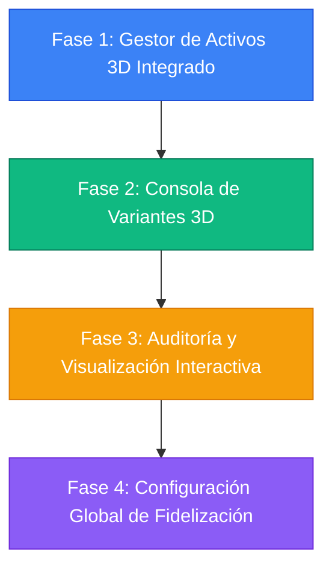

# 🗺️ Nuevo Mapa de Ruta: Consolidación de Gestión Administrativa (Backend & Frontend)

Este documento presenta un análisis de brechas exhaustivo enfocado exclusivamente en la consola de **Administración** del sistema, evaluando la sincronización entre el **Backend (NestJS / Prisma)** y el **Frontend (Next.js / Tailwind CSS / Shadcn)**. A partir de este diagnóstico, se establece un **Mapa de Ruta (Roadmap)** dividido en 4 Fases para lograr una gestión administrativa completa, robusta y libre de stubs o valores hardcodeados.

---

## 🔍 1. Análisis de Brechas Administrativas (Gap Analysis)

Tras auditar las interfaces de administración de la tienda, se identificaron los siguientes puntos críticos que requieren integración en el frontend:

### 📦 A. Gestión de Catálogo y Activos 3D (`/admin/products`)
* **Estado en Backend:** El modelo `AssetMapping` (`glbPath`, `usdzPath`, `fileSize`) y el modelo `Asset` (`fileName`, `filePath`, `mimeType`, `assetType`) están completamente soportados por la base de datos y la API de carga de archivos.
* **Brecha en Frontend (Crítica):** La vista `/admin/products` actual es una página estática (stub) que carga el componente `Asset3DUpload` con un identificador de producto de prueba estático (`productId="example-product-id"`). **No hay forma de que el administrador elija un producto real de su catálogo para asociarle y subirle su modelo 3D GLB o USDZ.**

### 🎨 B. Gestión de Variantes de Productos (`/admin/inventory`)
* **Estado en Backend:** El modelo `ProductVariant` (`productId`, `name`, `sku`, `price`, `stock`, `attributes`) está definido en Prisma, lo que permite un control granular de productos que difieren por talla, color o material.
* **Brecha en Frontend (Alta):** El formulario de creación de productos en la tabla de inventario (`InventoryTable.tsx`) solo permite ingresar valores individuales y planos (`price`, `stock`, `sku`). **No existe soporte de variantes en la UI**, impidiendo la venta de variaciones de modelos 3D con diferentes materiales o tamaños.

### 🎥 C. Previsualización y Control de Calidad 3D en la Consola
* **Estado en Backend:** Totalmente capaz de servir los archivos 3D estáticos y asociarlos a los productos creados.
* **Brecha en Frontend (Media):** Cuando el administrador sube un modelo 3D, no puede validar si se cargó correctamente, ni verificar sus dimensiones u orientación. **Falta un modal de previsualización 3D interactivo (`<model-viewer>`)** en la tabla de inventario o productos para auditar la visualización antes de publicarla.

---

## 🗺️ 2. Mapa de Ruta de Implementación por Fases

A continuación se detalla el plan de acción estructurado en 4 fases incrementales para completar e integrar la consola administrativa al 100%.

---

### 🔵 FASE 1: Gestor de Activos 3D Integrado (Prioridad Alta)
*El objetivo es eliminar el hardcodeo de la subida de modelos 3D y permitir la asignación de archivos GLB y USDZ a productos reales.*

#### 🛠️ Acciones del Frontend:
1. **Rediseño de `/admin/products/page.tsx`:**
   * Crear una vista con un listado dinámico de todos los productos del catálogo.
   * Al hacer clic en un producto, desplegar un panel lateral (Sheet de Shadcn) o modal que cargue dinámicamente `<Asset3DUpload productId={selectedProduct.id} />` inyectándole el ID correspondiente.
2. **Acceso desde Inventario (`/admin/inventory`):**
   * Incorporar un botón rápido con el ícono de un cubo 3D (`Box`) en cada fila de la tabla `InventoryTable.tsx`.
   * Este botón abrirá directamente el selector de archivos para cargar los modelos GLB/USDZ de ese producto específico de forma inmediata.

#### ⚙️ Acciones del Backend:
* Verificar que el endpoint `POST /assets/upload` cuente con validaciones completas de sanitización de archivos (MIME types correctos para formatos 3D).

---

### 🟢 FASE 2: Consola de Variantes de Productos (Prioridad Media-Alta)
*El objetivo es dotar al administrador de la capacidad de crear y gestionar SKUs complejos con variantes de color, tamaño o material, vinculándolas a modelos 3D específicos.*

#### 🛠️ Acciones del Frontend:
1. **Formulario de Creación Enriquecido:**
   * Ampliar el modal "Registrar Nuevo Producto" en `InventoryTable.tsx` para incluir una casilla colapsable de "Este producto tiene variantes".
   * Permitir la adición dinámica de atributos (Ej: Color: Rojo, Azul; Material: Madera, Metal).
2. **Generador Dinámico de SKUs de Variantes:**
   * Crear una sub-tabla dentro del modal que auto-genere las combinaciones (Ej: `PRD-ROJO-MADERA`) y permita especificar un precio y stock individual por variante.

#### ⚙️ Acciones del Backend:
* Desarrollar endpoints dedicados bajo `/products/:id/variants` (`GET`, `POST`, `PATCH`, `DELETE`) en `ProductsController` para sincronizar las variantes en la base de datos a través de Prisma.

---

### 🟡 FASE 3: Auditoría y Visualización 3D Interactiva (Prioridad Media)
*El objetivo es asegurar el control de calidad de la experiencia de compra 3D mediante visualización interactiva interna.*

#### 🛠️ Acciones del Frontend:
1. **Integración de `<model-viewer>` en Admin:**
   * Importar la librería de Google `@google/model-viewer` en la consola administrativa.
   * Diseñar un modal de previsualización 3D (`PREVIEW 3D`) accesible desde las tablas de productos o inventarios.
2. **Herramientas de Auditoría:**
   * Permitir al administrador girar el modelo a 360°, encender/apagar luces ambientales de prueba y comprobar si la escala y sombras se renderizan correctamente antes de habilitar el modelo para los clientes.

---

### 🟣 FASE 4: Consolidación del Panel de Configuración Global (Prioridad Baja)
*El objetivo es proveer al administrador de una pantalla de control de configuraciones del negocio para las mecánicas de fidelización.*

#### 🛠️ Acciones del Frontend:
1. **Panel en `/admin/settings`:**
   * Crear una sección interactiva para ajustar variables globales del negocio:
     * Porcentaje de descuento por catálogo para usuarios VIP (Plata/Oro).
     * Equivalencia del valor de puntos (Ej: variar S/. 1.00 por cada 100 puntos a S/. 1.50).
     * Puntos otorgados por compra y por referidos (patrocinador vs invitado).
2. **Controles Financieros:**
   * Habilitar el control del IGV (impuestos) y tarifas de envíos generales de manera dinámica.

---

## 🧪 3. Plan de Verificación de Calidad para el Gestor 3D

Para asegurar el éxito de la integración de la Fase 1, se establece el siguiente protocolo de prueba:

1. **Carga y Asociación Real de Modelos:**
   * Crear un producto real mediante `/admin/inventory` (Ej: "Lámpara de Escritorio Minimalista").
   * Ir al listado, hacer clic en subir modelo 3D y cargar un archivo `.glb` real.
   * Confirmar mediante la base de datos que el registro en `asset_mappings` and `assets` apunta exactamente al UUID de la lámpara.
2. **Visualización en Storefront:**
   * Ingresar como cliente en `/catalog` y comprobar que la tarjeta de la lámpara ahora muestra el indicador **3D VIEW** activo y permite visualizarla.
