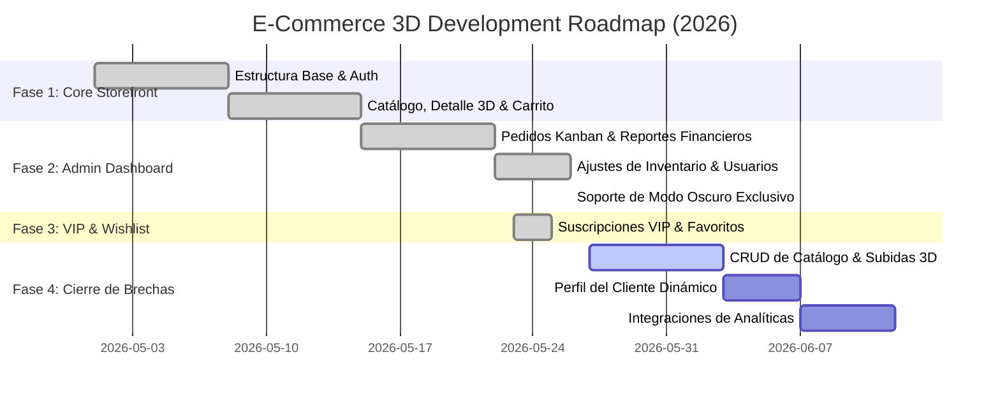

# 🗺️ E-Commerce 3D — System Roadmap & Gap Analysis
> **Stack Tecnológico:** NestJS 10 (TypeScript) + Prisma 7 (PostgreSQL) + Docker · Next.js 16 (App Router) + Tailwind CSS v4 + Zustand + shadcn/ui

Este documento provee un análisis de brechas estructurales (*Gap Analysis*) y una hoja de ruta (*Roadmap*) exhaustiva del ecosistema completo. Cubre la alineación del **Backend (`tienda-back`)** y el **Frontend (`tienda-front`)**, detallando qué módulos están 100% operativos, qué componentes faltan por implementar, cuáles son las brechas críticas de experiencia de usuario y el plan de acción para los próximos sprints.

---

## 1. Estado Actual del Sistema (Auditoría de Código)

### 1.1 Módulos Backend (`tienda-back`) — Cobertura y Arquitectura
El backend está estructurado en base a módulos autocontenidos en NestJS con decoradores globales, tuberías de validación robustas (`class-validator`), interceptores de logs, y manejo elegante de excepciones de base de datos con Prisma.

| Módulo Backend | Controlador (`.controller.ts`) | Servicio (`.service.ts`) | Modelo de Prisma (`schema.prisma`) | Estado de Implementación |
| :--- | :--- | :--- | :--- | :--- |
| **`auth`** | ✅ `AuthController` | ✅ `AuthService` | (Usa el modelo `User`) | **100% Operativo** (Local JWT, Passport-Local, Guards globales) |
| **`users`** | ✅ `UsersController` | ✅ `UsersService` | `model User` | **100% Operativo** (Roles: USER, ADMIN, SUPER_ADMIN, control de suspensión) |
| **`products`** | ✅ `ProductsController` | ✅ `ProductsService` | `model Product` & `model Category` | **100% Operativo** (Servicio CRUD completo, jerarquía de categorías recursivas) |
| **`assets`** | ✅ `AssetsController` | ✅ `AssetsService` | `model Asset` (GLB/USDZ) | **100% Operativo** (Subida física a volumen de Docker, soporte AR/VR) |
| **`inventory`** | ✅ `InventoryController` | ✅ `InventoryService` | `model InventoryMovement` | **100% Operativo** (Ajuste de stock manual, log contable de movimientos) |
| **`orders`** | ✅ `OrdersController` | ✅ `OrdersService` | `model Order` & `model OrderItem` | **100% Operativo** (Estados de pedido, cascadas de base de datos) |
| **`payments`** | ✅ `PaymentsController` | ✅ `PaymentsService` | `model Payment` (Culqi/Yape) | **100% Operativo** (Simulación completa de pasarelas y estados de pago) |
| **`loyalty`** | ✅ `LoyaltyController` | ✅ `LoyaltyService` | `model LoyaltyAccount` & `model PointsTransaction` | **100% Operativo** (Sistema de tiers, acumulación y canje ACID) |
| **`subscriptions`**| ✅ `SubscriptionsController`| ✅ `SubscriptionsService`| `model Subscription` & `model SubscriptionPlan` | **100% Operativo** (Planes VIP, cron de expiración, renovaciones) |
| **`notifications`**| ✅ `NotificationsController`| ✅ `NotificationsService`| `model Notification` | **100% Operativo** (Campana en tiempo real, histórico de logs de usuario) |
| **`wishlist`** | ✅ `WishlistController` | ✅ `WishlistService` | `model WishlistItem` | **100% Operativo** (Cascada segura de borrado, relaciones íntegras) |
| **`reports`** | ✅ `ReportsController` | ✅ `ReportsService` | (Lectura de data agregada) | **100% Operativo** (Finanzas y Analítica agregada de ventas) |
| **`extensions`** | 🔴 No existe | 🔴 No existe | No definido | **0% - Brecha del Sistema** (Pendiente de diseño para integraciones) |

---

### 1.2 Páginas y Rutas Frontend (`tienda-front`) — Cobertura de Vistas

#### 🛒 Storefront (Cliente)
| Ruta / Feature | Tipo | Componente / Estado | Estado de Integración |
| :--- | :--- | :--- | :--- |
| `/` | Page | `HomePage` (Visualización de catálogo destacado) | ✅ Integrado (Muestra catálogo) |
| `/catalog` | Page | `CatalogPage` (Búsqueda, grilla y filtros de productos) | ✅ Integrado con `productsService` |
| `/catalog/[slug]` | Page | `ProductDetailPage` (Visor 3D interactivo para GLB/USDZ) | ✅ Integrado con visor Three.js/ModelViewer |
| `/cart` | Drawer | `CartDrawer` (Zustand State, cálculo de subtotales e ítems) | ✅ Integrado y sincronizado localmente |
| `/checkout` | Page | `CheckoutPage` (Dirección, métodos de pago Culqi/Yape/Plin/Cash) | ✅ Integrado con pasarela de pagos simulada |
| `/wishlist` | Page | `WishlistPage` (Listado de favoritos reactivo) | ✅ Integrado con `wishlist.service.ts` |
| `/account` | Page | `AccountPage` (Perfil de usuario y datos personales) | ⚠️ **BRECHA** (Es un placeholder estático simple) |
| `/account/orders` | Page | `OrdersPage` (Historial de pedidos, barra de progreso y badges) | ✅ Integrado con `orders.service.ts` |
| `/account/loyalty` | Page | `LoyaltyPage` (Nivel de fidelidad, barra de puntos, canjes) | ✅ Integrado con `loyalty.service.ts` |
| `/account/subscription` | Page | `SubscriptionPage` (Administración de membresía VIP activa) | ✅ Integrado con `subscriptions.service.ts` |

#### 🔒 Admin Dashboard (Administración)
| Ruta / Feature | Tipo | Componente / Estado | Estado de Integración |
| :--- | :--- | :--- | :--- |
| `/admin` | Page | `DashboardPage` (Resumen de ventas y alerta de stock) | ✅ Integrado (Alertas Destructive de stock) |
| `/admin/analytics` | Page | `AnalyticsPage` (Recharts AreaCharts y KPI de usuarios) | ✅ Integrado con `reportsService` |
| `/admin/orders` | Page | `OrderKanban` & `OrderTable` (Kanban interactivo y tabla tabular) | ✅ Integrado con alternancia de vista de pedidos |
| `/admin/inventory` | Page | `InventoryTable` (Ajustes de stock rápidos y logs de movimientos) | ✅ Integrado con `inventory.service.ts` |
| `/admin/users` | Page | `UserTable` (Administración de roles, estado y suspensión) | ✅ Integrado con `users.service.ts` |
| `/admin/finance` | Page | `FinanceLedger` (Libro contable detallado y exportador CSV) | ✅ Integrado con Recharts y reportes reales |
| `/admin/products` | Page | `ProductsPage` (Subida de modelos 3D aislados) | ⚠️ **BRECHA CRÍTICA** (No hay CRUD de catálogo) |
| `/admin/account` | Page | `AdminAccountPage` (Perfil personal del administrador) | ✅ Integrado (Formularios y cambio de clave) |
| `/admin/settings` | Page | `AdminSettingsPage` (Parámetros globales, 3D, métodos de pago) | ✅ Integrado (Con Modo Oscuro en Sidebar) |

---

## 2. 🚨 Gap Analysis — Brechas Detectadas en el Ecosistema

Analizando exhaustivamente ambos repositorios, se han detectado las siguientes **brechas clave** entre lo que el backend expone y lo que la interfaz de usuario implementa realmente:

### 🔴 Brecha 1: Ausencia de CRUD de Catálogo en `/admin/products` (Alta Prioridad)
*   **Estado Backend:** El backend posee un `ProductsController` con soporte completo para crear, listar con paginación, buscar, actualizar y eliminar productos y variantes (`ProductVariant` con JSON de atributos).
*   **Estado Frontend:** La página `/admin/products` del frontend es un esqueleto básico que solo renderiza una sección estática para subir un modelo 3D con un ID de producto mock (`"example-product-id"`). **No existe una tabla de productos, ni formularios de creación, ni edición de campos como precio, SKU, stock o categoría.**
*   **Impacto:** Los administradores no pueden gestionar los productos del catálogo directamente desde la interfaz, rompiendo el flujo operativo de la tienda.
*   **Solución Recomendada:** Implementar un `ProductTable` y un `ProductFormDialog` en `/admin/products` que consuma `productsService` para gestionar el catálogo en tiempo real.

### 🟠 Brecha 2: Vista de Perfil de Cliente `/account` como Placeholder (Media Prioridad)
*   **Estado Backend:** El backend posee un servicio `usersService.updateProfile` que permite a cualquier usuario autenticado modificar su información básica (nombres, apellidos, correo, teléfono).
*   **Estado Frontend:** La página `/account` de los clientes muestra tarjetas estáticas con el texto *"Account details coming soon..."*. No hay formularios reales para editar el perfil del cliente.
*   **Impacto:** Los usuarios de la tienda no pueden actualizar sus datos personales, contraseñas o datos de contacto.
*   **Solución Recomendada:** Implementar en `/account/page.tsx` un formulario dinámico reactivo integrado a `users.service.ts` similar al del panel de administración, mostrando además de forma elegante el Tier de Fidelización del cliente.

### 🟠 Brecha 3: Integración de la Subida de Modelos 3D en el Flujo del Producto (Media Prioridad)
*   **Estado Backend:** El módulo `assets` del backend maneja correctamente la asociación física de archivos `.glb` o `.usdz` con un producto específico.
*   **Estado Frontend:** El componente `Asset3DUpload.tsx` está listo y es visualmente excelente, pero está aislado.
*   **Impacto:** Al crear un producto nuevo, el flujo para subir su correspondiente modelo 3D y asociarlo al catálogo no está integrado en un solo paso intuitivo.
*   **Solución Recomendada:** Integrar `Asset3DUpload` dentro del formulario de creación y edición de productos como una pestaña o paso de subida dinámico.

### 🟡 Brecha 4: Módulo de Extensiones e Integraciones Vacío (Baja Prioridad)
*   **Estado Backend:** El directorio `src/modules/extensions` no existe o no tiene lógica.
*   **Estado Frontend:** La página de configuración menciona las integraciones, pero no hay servicios de analíticas reales conectados (Google Analytics) ni automatización de correos (ej. SendGrid).
*   **Impacto:** Falta de automatización comercial en escenarios reales de producción.
*   **Solución Recomendada:** Diseñar en la Fase 4 un módulo ligero en NestJS para despachar Webhooks hacia herramientas externas o integraciones.

---

## 3. 🗺️ Roadmap de Desarrollo Completo (Fase 1 a 4)

Este plan de trabajo organiza las tareas pasadas y futuras en sprints lógicos de ejecución para alinear al 100% ambas bases de código.



### 1. Fase 1: Arquitectura Base e Integración Core (COMPLETADA ✅)
*   **Backend:** Configuración de Prisma ORM, Docker Compose para PostgreSQL, autenticación mediante JWT y encriptación bcrypt.
*   **Frontend:** Integración de Next.js 16 con Tailwind CSS, Zustand para control de carrito de compras, y primer maquetado del visor de modelos 3D.
*   **Storefront:** Páginas de login, registro, grilla del catálogo con filtros básicos y checkout integrado con pasarelas.

### 2. Fase 2: Experiencia Administrativa & Operaciones (COMPLETADA ✅)
*   **Kanban de Pedidos Avanzado:** Tablero con arrastrar y soltar, filtros interactivos de fecha/precio/método de pago, botones de navegación horizontal flotantes adaptables al Sidebar.
*   **Métricas Contables (`FinanceLedger`):** Gráficos financieros detallados utilizando Recharts, ticket promedio, transacciones por tipo de pago y descargas de reportes en formato CSV.
*   **Gestión de Inventario & Usuarios:** Logs de movimientos de stock físicos integrados al backend y control administrativo de estados de usuario.
*   **Modo Oscuro Contextual:** Integrado únicamente dentro del menú de usuario (`NavUser`) al lado del nombre en el Sidebar, con script anti-destellos (anti-FOUC) en el `<head>` del HTML.

### 3. Fase 3: Fidelización & Membresías VIP (COMPLETADA ✅)
*   **Suscripciones VIP:** CRUD completo en frontend de planes mensuales y anuales VIP, con simulación de cobro recurrente e interfaces de cancelación inmediata.
*   **Wishlist Relacional:** Endpoints reales `GET/POST/DELETE` en NestJS sincronizados reactivamente en el storefront mediante Zustand para guardar favoritos.

### 4. Fase 4: Cierre de Brechas Críticas & Producción (EN DESARROLLO 🚀)
*   **Sprint 4.1: CRUD de Productos Completo (Catálogo Admin)**
    *   [ ] Crear `ProductTable.tsx` en `/admin/products` para listar todos los SKUs, precios y stock real de base de datos.
    *   [ ] Crear `ProductFormDialog.tsx` que admita variantes complejas (color, material) mediante inputs JSON reactivos.
    *   [ ] Integrar el componente `Asset3DUpload.tsx` directamente como un paso del formulario de creación del producto.
*   **Sprint 4.2: Actualización de Cuenta de Cliente**
    *   [ ] Reemplazar el placeholder de `/account` con formularios interactivos de edición de perfil.
    *   [ ] Mostrar gráficamente el historial de transacciones de puntos acumulados en el programa de lealtad.
*   **Sprint 4.3: Integración y Extensiones Externas**
    *   [ ] Conectar eventos de analíticas del visor 3D (tiempo de visualización, interacciones AR) con Google Analytics.
    *   [ ] Diseñar un simulador de despachos de correo para notificaciones de cambio de estado de pedidos.

---

## 4. Progreso Visual del Proyecto

### BACKEND (`tienda-back`)
```
──────────────────────────────────────────────────────────────────────────
✅ auth (JWT, Guards, Roles)        ██████████ 100%
✅ products (CRUD, Variants)        ██████████ 100%
✅ assets (Upload, Docker Volumes)  ██████████ 100%
✅ orders (Relaciones Cascade)      ██████████ 100%
✅ payments (Culqi/Yape Webhooks)   ██████████ 100%
✅ loyalty (Transactions ACID)      ██████████ 100%
✅ inventory (Ajuste, Audit Trail)  ██████████ 100%
✅ notifications (Real-time logs)   ██████████ 100%
✅ subscriptions (VIP Billing)      ██████████ 100%
✅ wishlist (Database unique index) ██████████ 100%
🔴 extensions (Integraciones)       ░░░░░░░░░░   0%
──────────────────────────────────────────────────────────────────────────
```

### FRONTEND (`tienda-front`)
```
──────────────────────────────────────────────────────────────────────────
✅ landing/home                     ██████████ 100%
✅ catalog (Filtros & Grilla)       ██████████ 100%
✅ product-detail (Viewer 3D / AR)  ██████████ 100%
✅ cart (Zustand state store)       ██████████ 100%
✅ checkout (Culqi/Yape inputs)     ██████████ 100%
✅ wishlist (Reactive favorites)    ██████████ 100%
⚠️ account (Profile update form)    ████░░░░░░  40% (Placeholder)
✅ account/orders (Logs, Progress)  ██████████ 100%
✅ account/loyalty (Tiers, Progress)██████████ 100%
✅ account/subscription (VIP Manage)██████████ 100%
✅ admin/orders (Kanban & Table)    ██████████ 100%
✅ admin/finance (Charts & CSV)     ██████████ 100%
✅ admin/inventory (Alerts, logs)   ██████████ 100%
✅ admin/users (Roles, suspend Dlg) ██████████ 100%
🔴 admin/products (CRUD Catálogo UI) █░░░░░░░░░  10% (Placeholder)
✅ admin/settings (Theme, Gateways) ██████████ 100%
──────────────────────────────────────────────────────────────────────────
```
