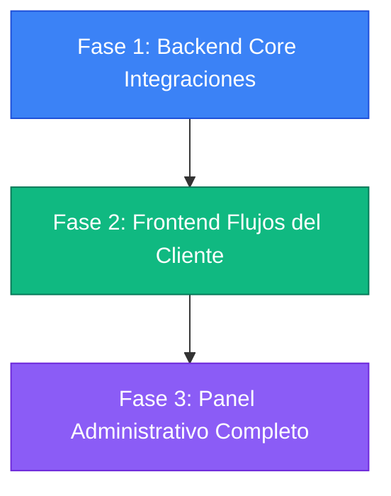

# Mapa de Ruta para la Integración Total: Club Lealtad, Suscripciones y Referidos

Este documento presenta un análisis exhaustivo del estado actual del sistema (Backend y Frontend) y detalla la brecha de integración de los tres módulos interactivos añadidos recientemente: **Suscripciones Premium**, **Club Puntos de Lealtad 3D** y el **Programa de Referidos**. Asimismo, establece el **Mapa de Ruta (Roadmap)** detallado para consolidar estas funcionalidades tanto para el **Cliente** como para el **Administrador**.

---

## 📊 1. Análisis del Estado Actual

### 💎 A. Módulo de Suscripciones (Premium 3D)

#### ⚙️ Backend (`/modules/subscriptions`)
* **Base de Datos (Prisma):** Modelos `SubscriptionPlan` (catálogo de planes y características en JSON) y `Subscription` (vinculación de usuario con plan, estado, vigencia y renovaciones).
* **Servicios & Controladores:**
  * `Get /subscriptions/plans` (Público): Lista de planes activos.
  * `Get /subscriptions/me` (Autenticado): Retorna la membresía activa actual.
  * `Post /subscriptions/subscribe` (Autenticado): Permite suscribirse calculando fechas según ciclo (`MONTHLY`, `QUARTERLY`, `YEARLY`). Crea notificaciones del sistema.
  * `Post /subscriptions/cancel` (Autenticado): Cancela renovación automática (cambia a `CANCELLED` pero mantiene vigencia hasta `endDate`).
* **✅ Integración en Backend (Consolidada):**
  * **Integración con Órdenes:** El servicio de creación de pedidos (`OrdersService.create`) ahora verifica suscripciones activas/vigentes del usuario para aplicar automáticamente el **10% de descuento directo** y asignar el costo de envío a **0** (envío gratuito).
  * **Panel de Administración Completo:** Endpoints administrativos habilitados bajo roles `ADMIN` y `SUPER_ADMIN` para crear/editar planes de suscripción, consultar la lista global de suscriptores activos, y forzar bajas/pausas de membresías.

#### 🎨 Frontend (`/account/subscription`)
* **Servicio (`subscription.service.ts`):** Perfectamente mapeado a los endpoints de suscripción del backend.
* **Interfaz del Cliente (`/account/subscription/page.tsx`):** UI de alta gama que muestra el plan actual, vigencia y facturación automática. Permite la contratación de membresías y la desactivación del auto-renovado mediante cuadros de diálogo interactivos.
* **✅ Integración en Frontend (Consolidada):**
  * **Visualización en Checkout:** La pasarela de pago (`/checkout`) refleja visualmente el beneficio del **10% de descuento premium** y el **envío gratuito** del plan VIP activo, sincronizando el cálculo contable final al crear el pedido.
  * **Vista de Administración VIP:** Nueva sección habilitada en `AdminSidebar.tsx` bajo `/admin/subscriptions` que muestra gráficos de distribución y permite administrar membresías reales.

---

### 🏆 B. Club Puntos de Lealtad 3D

#### ⚙️ Backend (`/modules/loyalty`)
* **Base de Datos (Prisma):** Modelos `LoyaltyAccount` (puntos acumulados y nivel de membresía) y `PointsTransaction` (historial detallado de sumas y restas de puntos).
* **Servicios & Controladores:**
  * `Get /loyalty/me` (Autenticado): Retorna balance actual, Tiers (`BRONZE`, `SILVER`, `GOLD`, `PLATINUM`), umbrales de puntos e historial de transacciones.
  * `Post /loyalty/redeem` (Autenticado): Deduce puntos (100 puntos = S/. 1.00) y devuelve el descuento en soles.
  * **Integración Activa:** Al cambiar el estado de una orden a `DELIVERED` en `OrdersService.updateStatus`, se acumulan automáticamente puntos equivalentes a `floor(orderTotal * 10)`.
* **✅ Integración en Backend (Consolidada):**
  * **Canje Conectado a la Orden:** `OrdersService.create` valida y descuenta de forma atómica los puntos solicitados por el usuario directamente en la transacción del pedido, aplicando el descuento equivalente (S/. 1.00 por cada 100 puntos) y actualizando el tier del cliente en tiempo real.
  * **Operación de Administración de Puntos:** Endpoints habilitados para listar balances globales de puntos y realizar abonos/débitos manuales con registro de auditoría ACID.

#### 🎨 Frontend (`/account/loyalty`)
* **Hook & Servicio (`useLoyalty.ts` / `loyalty.service.ts`):** Totalmente conectados a la API para consulta y canje.
* **Interfaz del Cliente (`/account/loyalty/page.tsx`):** UI premium con barra de progreso interactiva de Tiers, calculadora de canje de puntos con validación en tiempo real y tabla de transacciones de puntos.
* **✅ Integración en Frontend (Consolidada):**
  * **Selector de Canje en Checkout:** Un componente colapsable con botones de incremento/decremento permite al cliente aplicar descuentos de puntos en tiempo real (múltiplos de 100).
  * **Sincronización de Reglas:** Se unificó la regla de acumulación visual (`floor(GrandTotal * 10)`) alineándola perfectamente con el backend.
  * **Panel Administrativo de Fidelización:** Vista en `/admin/loyalty` para auditar balances, historial de transacciones y realizar ajustes manuales.

---

### 🎁 C. Programa de Referidos

#### ⚙️ Backend (`/modules/referrals`)
* **Base de Datos (Prisma):** Modelo `Referral` (registra patrocinador, invitado, estado `PENDING`/`COMPLETED` y puntos otorgados).
* **Servicios & Controladores:**
  * `Post /referrals/apply` (Autenticado): Asocia un patrocinador a un usuario recién registrado (valida que no sea autorreferido ni duplicado).
  * `Get /referrals/my-code`: Genera link y código basados en el ID único del usuario.
  * `Get /referrals/stats`: Obtiene acumulados de referidos (pendientes, completados, puntos totales).
  * `Get /referrals/admin` (Admins): Devuelve listado general paginado de todos los referidos para monitoreo administrativo.
  * **Trigger de Conversión:** El webhook de pagos (`PaymentsService.completePayment`) dispara exitosamente el trigger `handleUserFirstPurchase`, el cual cambia el estado del referido a `COMPLETED` y distribuye automáticamente **500 pts al patrocinador y 50 pts al invitado** al procesarse el primer pago.
* **⚠️ Brecha en Backend:**
  * Ninguna brecha crítica a nivel funcional, el flujo lógico está completo e interconectado con el sistema de pagos.

#### 🎨 Frontend (`/account/referrals`)
* **✅ Integración en Frontend (Consolidada):**
  * **UI Conectada a la API:** `/account/referrals` sincroniza el código único, enlace del patrocinador, estadísticas de conversión y amigos invitados reales.
  * **Flujo de Registro por Referido:** `/register` captura dinámicamente `?ref=xxx` y asocia el patrocinador de forma transparente tras crear el usuario.
  * **Auditoría Administrativa de Referidos:** Pantalla en `/admin/referrals` integrada con los endpoints administrativos de auditoría de referidos.

---

## 🗺️ 2. Mapa de Ruta (Roadmap) de Integración

A continuación se detalla el plan de acción estructurado en 3 Fases prioritarias para unificar y poner en marcha el sistema completo.

---

### 🔵 FASE 1: Backend Core & Ajustes Transaccionales (Prioridad Alta)
*El objetivo es hacer que el motor de órdenes y pagos respete de forma automática las membresías VIP y los descuentos de lealtad aplicados.*

#### 1. Modificación de `OrdersService.create` para Beneficios VIP y Puntos
* **Consulta de Suscripción:** Verificar si el `userId` tiene una suscripción con status `ACTIVE` o `CANCELLED` (si aún está vigente).
* **Aplicación de Reglas Premium:**
  * Si la membresía activa posee `premiumDiscounts: true`, restar el **10% de descuento directo** sobre el subtotal.
  * Si posee `freeShipping: true` (o la membresía otorga envíos gratuitos), definir `shipping = 0` (en lugar de `15.0`).
* **Soporte para Puntos de Lealtad (Canje):**
  * Modificar `CreateOrderDto` para recibir un campo opcional `redeemedPoints: number`.
  * Validar en la transacción que el usuario tenga ese balance de puntos disponible.
  * De ser así, deducir los puntos (usando `LoyaltyService.redeemPoints`) y aplicar el descuento calculado (`discount = pointsRedeemed / 100`) directamente sobre el total final de la orden.
  * Almacenar este descuento en el campo `discount` de la tabla `orders` para auditoría contable.

#### 2. Implementación de Rutas Administrativas
* **Suscripciones Admin (`/subscriptions/admin`):**
  * `Get /subscriptions/admin/list`: Listado paginado de usuarios con suscripción activa.
  * `Post /subscriptions/admin/plans`: Ruta protegida para crear o modificar planes de suscripción.
  * `Delete /subscriptions/admin/:id`: Permitir a un súper admin rescindir o pausar una suscripción por falta de pago.
* **Lealtad Admin (`/loyalty/admin`):**
  * `Get /loyalty/admin/balances`: Listar balances globales de puntos.
  * `Post /loyalty/admin/adjust`: Permitir la adición/sustracción manual de puntos a un usuario específico por incidencias de servicio.

---

### 🟢 FASE 2: Frontend - Flujos e Interconexión del Cliente (Prioridad Media)
*El objetivo es conectar las interfaces visuales del cliente con la API real y perfeccionar la experiencia en el Checkout.*

#### 1. Integración de la Página de Referidos (`/account/referrals`)
* Crear el archivo de servicio `services/referrals.service.ts` con mapeo a `/referrals/my-code`, `/referrals/stats` y `/referrals/apply`.
* Conectar `/account/referrals/page.tsx` para consumir este servicio en un `useEffect`:
  * Cargar dinámicamente el link y código real del usuario patrocinador.
  * Reemplazar la tabla hardcodeada por el listado de referidos devuelto por el backend.
  * Mostrar las estadísticas reales del programa (puntos ganados, amigos pendientes y completados).

#### 2. Flujo de Captura de Referidos en Registro
* Modificar el middleware o la página `/register` para leer el query string `?ref=xxx` de la URL.
* Guardar temporalmente el código del patrocinador en `localStorage` o en el estado de registro.
* Tras una llamada exitosa de creación de cuenta en el backend, disparar inmediatamente `Post /referrals/apply` con el ID del patrocinador para dejar enlazada la relación de referidos desde el primer minuto.

#### 3. Checkout Enriquecido e Inmersivo
* **Visualización de Puntos Acumulables:** Corregir la fórmula estática en el resumen del checkout (`GrandTotal * 10`) para que coincida perfectamente con el cálculo oficial del backend.
* **Selector de Canje de Puntos:**
  * Agregar un componente colapsable en la barra lateral del resumen de compra que cargue el balance de puntos del cliente (vía `useLoyalty`).
  * Permitir al usuario ingresar la cantidad de puntos que desea canjear (en múltiplos de 100).
  * Mostrar en vivo el descuento aplicado (`-S/. X.00`) y restar este monto del total del carrito antes de proceder a la pasarela de pagos.
* **Cálculo Contable de Membresía VIP:**
  * Si el usuario cuenta con suscripción activa (consultar `/subscriptions/me` en checkout), aplicar automáticamente los beneficios VIP de manera visual (ej: *"Descuento VIP del 10% aplicado"* y *"Envío Premium Gratuito"*), inhabilitando el cobro de envío.
  * Enviar los parámetros de descuento calculados al endpoint `Post /orders` para que coincidan al 100% con los cálculos del backend.

#### 4. Rediseño del Panel General `/account/page.tsx`
* Rediseñar la página principal de la cuenta del usuario para que deje de mostrar la etiqueta "coming soon..." y pase a ser una cabina de control premium:
  * Mostrar una tarjeta ejecutiva del cliente con su foto/iniciales.
  * Visualizar un resumen rápido de su saldo de Puntos Club 3D y su Tier actual.
  * Añadir un widget rápido con el estado de su Suscripción Premium.
  * Listar los accesos rápidos a sus últimos pedidos completados o en camino.

---

### 🟣 FASE 3: Frontend - Panel Administrativo Consolidado (Prioridad Media-Baja)
*El objetivo es proveer a los administradores de la tienda una suite de control completa para monitorear y auditar la actividad interactiva de los usuarios.*

#### 1. Panel de Suscripciones Administrativo (`/admin/subscriptions`)
* **Creación de Nueva Ruta:** `/app/(admin)/admin/subscriptions/page.tsx`
* **Características Clave:**
  * **Dashboard de Suscriptores:** Gráfico de pastel (`recharts`) mostrando la distribución de planes contratados (Ej: Plan Bronce vs Plata vs Oro).
  * **Lista de Membresías:** Tabla paginada con buscador que liste todos los usuarios premium, sus fechas de inicio/vencimiento, y si tienen la renovación activa.
  * **Editor de Planes:** Interfaz interactiva para activar/desactivar planes de suscripción o editar sus precios y beneficios directamente desde el frontend.

#### 2. Panel de Control de Puntos y Lealtad (`/admin/loyalty`)
* **Creación de Nueva Ruta:** `/app/(admin)/admin/loyalty/page.tsx`
* **Características Clave:**
  * **Auditoría de Movimientos:** Tabla global con los últimos depósitos y canjes de puntos de todo el sistema.
  * **Gestor de Ajustes:** Buscador de usuarios que permita abrir una tarjeta de perfil y realizar un ajuste directo de puntos (Ej: otorgar 500 puntos manuales como cortesía de soporte).
  * **Métricas de Tiers:** Visualización rápida de cuántos clientes se ubican en cada nivel (Bronze, Silver, Gold, Platinum) para estrategias de marketing focalizadas.

#### 3. Auditoría del Programa de Referidos (`/admin/referrals`)
* **Creación de Nueva Ruta:** `/app/(admin)/admin/referrals/page.tsx`
* **Características Clave:**
  * **Monitoreo de Conversión:** Lista conectada a `/referrals/admin` que muestre la trazabilidad del referido (Quién refirió a quién, fecha de registro y cuándo se completó su primera compra).
  * **Control de Fraude:** Alerta visual si se detectan múltiples registros completados bajo la misma dirección IP u otros patrones sospechosos.

#### 4. Actualización del Sidebar y Menú de Breadcrumbs (`AdminSidebar.tsx` / `layout.tsx`)
* Integrar un nuevo grupo de navegación en la barra lateral del Administrador denominado **📈 MARKETING & FIDELIZACIÓN**.
* Incluir los siguientes accesos directos:
  * 💎 **Suscripciones VIP** (`/admin/subscriptions`)
  * 🏆 **Club de Puntos** (`/admin/loyalty`)
  * 🎁 **Programa de Referidos** (`/admin/referrals`)
* Actualizar el mapeador de breadcrumbs en `layout.tsx` para otorgar títulos limpios y coherentes a estas nuevas secciones jerárquicas.

---

## 🧪 3. Plan de Verificación y Calidad

Para garantizar que el sistema integrado funcione sin fisuras ni riesgos financieros (ej: exploits de doble descuento o duplicidad de canjes de puntos), se establece el siguiente protocolo de control:

### ⚙️ Pruebas Automatizadas (Backend)
1. **Prueba de Transaccionalidad de Pedidos:**
   * Validar que si una orden solicita canjear 500 puntos pero el usuario solo cuenta con 400 en base de datos, la transacción realice un rollback completo y lance un error `400 Bad Request`.
   * Verificar que al completarse la orden con descuento, el balance de puntos se actualice en la base de datos de manera sincronizada.
2. **Prueba de Reglas de Descuento VIP:**
   * Ejecutar un test unitario donde un usuario Premium compre un producto de S/. 100.00. Comprobar que el total calculado en base de datos resulte en S/. 90.00 (10% descuento) y que el costo de envío se asigne en S/. 0.00.
3. **Prueba del Trigger de Referidos:**
   * Simular el flujo completo: Registrar usuario A con el referido del usuario B -> Completar un pago exitoso para A -> Verificar que la cuenta de lealtad de B reciba +500 pts y la de A reciba +50 pts de forma atómica.

### 🖥️ Pruebas Manuales y de UI (Frontend)
1. **Validación del Flujo de Canje en Checkout:**
   * Utilizar la herramienta de pruebas en navegador para llenar el carrito, ir al checkout y aplicar un descuento parcial de puntos. Confirmar que el total visual en el resumen se actualice en vivo y coincida al centavo con la orden registrada en el backend.
2. **Auditoría de Vistas de Administrador:**
   * Acceder con una cuenta de rol `ADMIN` y comprobar que las nuevas rutas administrativas carguen correctamente los datos reales del backend sin retardos ni bucles de renderizado.
   * Intentar ingresar a las rutas `/admin/*` con un usuario de rol `CUSTOMER` y comprobar que el sistema bloquee el acceso redirigiendo al portal principal tal como lo dictan los esquemas de seguridad.
